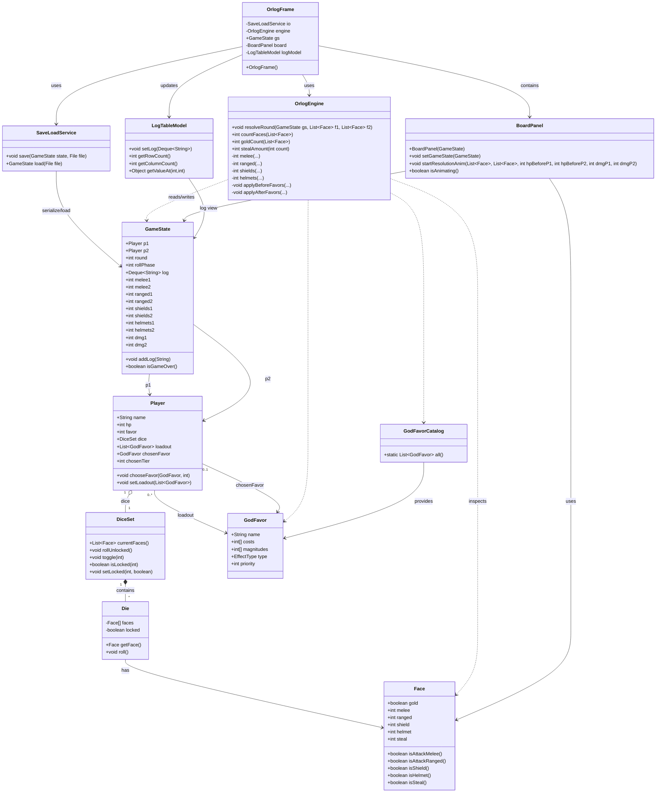

# Osztálydiagram – Orlog játék

Az alábbi mermaid kód írja le a program fő osztályait és kapcsolatait.

```mermaid
classDiagram
  direction TB

  %% IO
  class SaveLoadService {
    +void save(GameState state, File file)
    +GameState load(File file)
  }

  %% Model
  class GameState {
    +Player p1
    +Player p2
    +int round
    +int rollPhase
    +Deque~String~ log
    +int melee1
    +int melee2
    +int ranged1
    +int ranged2
    +int shields1
    +int shields2
    +int helmets1
    +int helmets2
    +int dmg1
    +int dmg2
    +void addLog(String)
    +boolean isGameOver()
  }

  class Player {
    +String name
    +int hp
    +int favor
    +DiceSet dice
    +List~GodFavor~ loadout
    +GodFavor chosenFavor
    +int chosenTier
    +void chooseFavor(GodFavor, int)
    +void setLoadout(List~GodFavor~)
  }

  class DiceSet {
    +List~Face~ currentFaces()
    +void rollUnlocked()
    +void toggle(int)
    +boolean isLocked(int)
    +void setLocked(int, boolean)
  }

  class Die {
    -Face[] faces
    -boolean locked
    +Face getFace()
    +void roll()
  }

  class Face {
    +boolean gold
    +int melee
    +int ranged
    +int shield
    +int helmet
    +int steal
    +boolean isAttackMelee()
    +boolean isAttackRanged()
    +boolean isShield()
    +boolean isHelmet()
    +boolean isSteal()
  }

  class OrlogEngine {
    +void resolveRound(GameState gs, List~Face~ f1, List~Face~ f2)
    +int countFaces(List~Face~)
    +int goldCount(List~Face~)
    +int stealAmount(int count)
    -int melee(...)
    -int ranged(...)
    -int shields(...)
    -int helmets(...)
    -void applyBeforeFavors(...)
    -void applyAfterFavors(...)
  }

  class GodFavor {
    +String name
    +int[] costs
    +int[] magnitudes
    +EffectType type
    +int priority
  }

  class GodFavorCatalog {
    +static List~GodFavor~ all()
  }

  %% UI
  class BoardPanel {
    +BoardPanel(GameState)
    +void setGameState(GameState)
    +void startResolutionAnim(List~Face~, List~Face~, int hpBeforeP1, int hpBeforeP2, int dmgP1, int dmgP2)
    +boolean isAnimating()
  }

  class OrlogFrame {
    +OrlogFrame()
    -SaveLoadService io
    -OrlogEngine engine
    +GameState gs
    -BoardPanel board
    -LogTableModel logModel
  }

  class LogTableModel {
    +void setLog(Deque~String~)
    +int getRowCount()
    +int getColumnCount()
    +Object getValueAt(int,int)
  }

  %% Relationships
  SaveLoadService --> GameState : serialize/load
  GameState --> Player : p1
  GameState --> Player : p2
  Player "1" o-- "1" DiceSet : dice
  DiceSet "1" *-- "*" Die : contains
  Die --> Face : has
  Player "0..*" --> GodFavor : loadout
  Player "0..1" --> GodFavor : chosenFavor
  OrlogEngine ..> GameState : reads/writes
  OrlogEngine ..> Face : inspects
  OrlogEngine ..> GodFavor
  OrlogEngine ..> GodFavorCatalog
  GodFavorCatalog --> GodFavor : provides
  OrlogFrame --> BoardPanel : contains
  OrlogFrame --> OrlogEngine : uses
  OrlogFrame --> SaveLoadService : uses
  OrlogFrame --> LogTableModel : updates
  BoardPanel --> GameState : renders
  BoardPanel --> Face : uses
  LogTableModel --> GameState : log view
```
